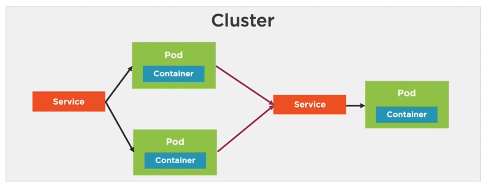

# Understanding Kubernetes (K8s)

These are my notes from tutorials on using K8s to deploy applications.

## Contents

* [Services](#services)
    * [ClusterIP](#clusterip)
    * [NodePort](#nodeport)
    * [LoadBalancer](#loadbalancer)
    * [ExternalName](#externalname)
* [References](#references)

## Services

Services abstract pod IP addresses from consumers. Pods are accessed instead via the service's name and configured domain name (same as service name) and port.

### ClusterIP

* Lets pods within the same cluster talk to each other
* Useful for accessing apps on other pods by referencing the service name instead of each pod's IP

### NodePort

* Exposes the node at the node's IP and a static port
* Useful for debugging specific pods by attaching a NodePort and referencing the service

### LoadBalancer

* Exposes the nodes externally
* Automatically creates NodePort and ClusterIP services
* Useful for auto-selecting "free" nodes from a pool of all nodes (replicas)

### ExternalName

* Acts as an alias for an external service
* Hides the details of the external service from the cluster
* Useful for apps by referencing the alias instead of the actual external domain

## References

* [Kubernetes for Developers: Core Concepts](https://app.pluralsight.com/library/courses/kubernetes-developers-core-concepts)
