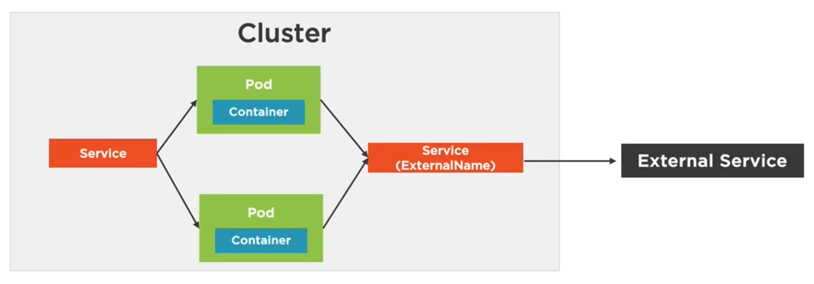
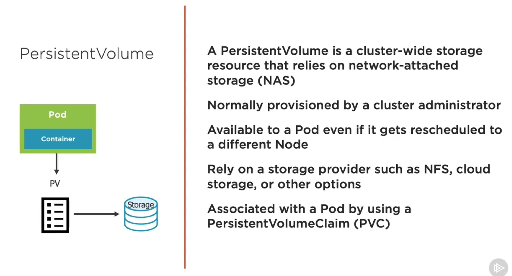
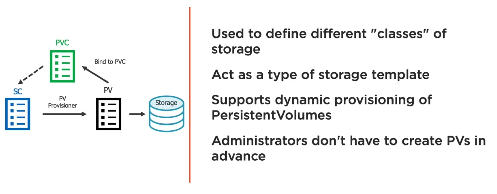
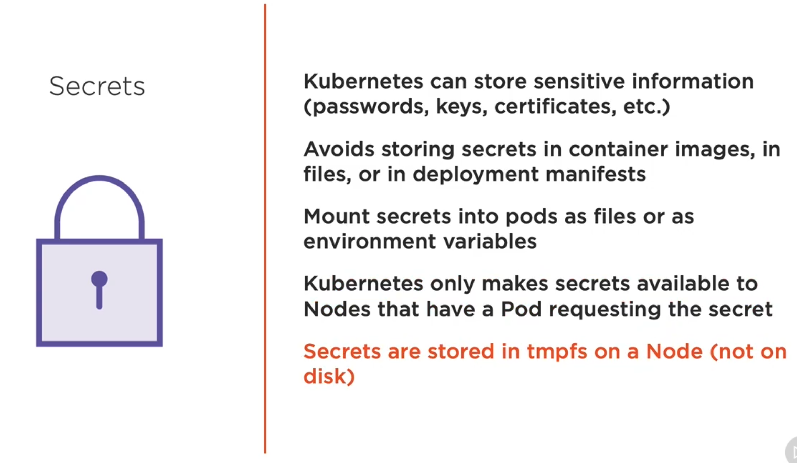
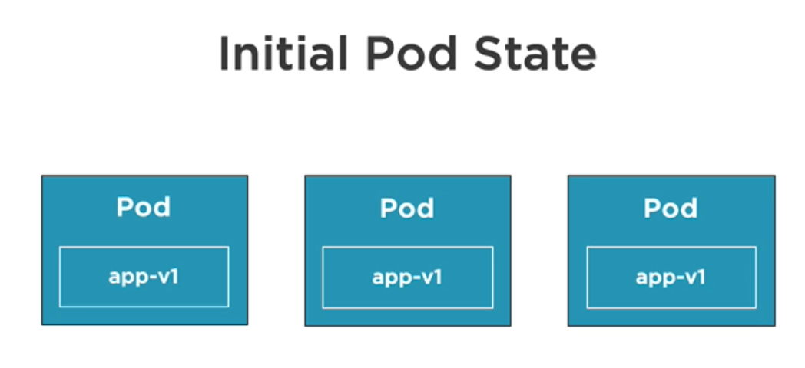
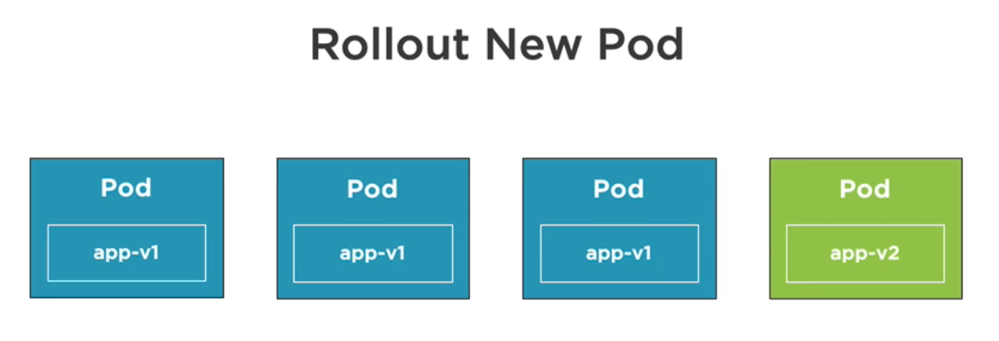
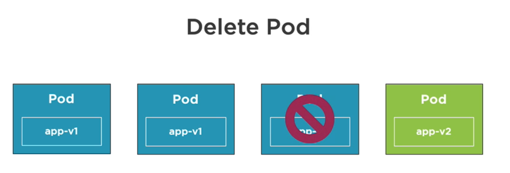
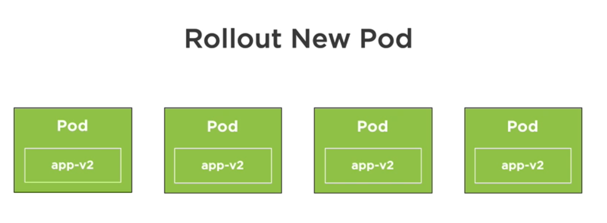
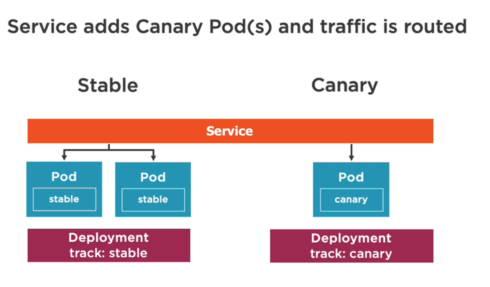

# Understanding Kubernetes (K8s)

These are my notes from tutorials on using K8s to deploy applications.

## Contents

* [Services](#services)
    * [ClusterIP](#clusterip)
    * [NodePort](#nodeport)
    * [LoadBalancer](#loadbalancer)
    * [ExternalName](#externalname)
* [Volumes](#volumes)
    * [PersistentVolume](#persistentvolume)
    * [StorageClass](#storageclass)
* [ConfigMap](#configmap)
* [Secrets](#secrets)
    * [Creating a Secret](#creating-a-secret)
    * [Accessing Secrets](#accessing-secrets)
    * [Best Practices](#best-practices)
* [Deployments](#deployments)
    * [RollingUpdate](#rollingupdate)
    * [Canary](#canary)
* [Troubleshooting](#troubleshooting)
* [Sample Application](#sample-application)
* [References](#references)

## Services

Services abstract pod IP addresses from consumers. Pods are accessed instead via the service's name and configured domain name (same as service name) and port.

### ClusterIP

* Lets pods within the same cluster talk to each other
* Useful for accessing apps on other pods by referencing the service name instead of each pod's IP


### NodePort

* Exposes the node at the node's IP and a static port
* Useful for debugging specific pods by attaching a NodePort and referencing the service


### LoadBalancer

* Exposes the nodes externally
* Automatically creates NodePort and ClusterIP services
* Useful for auto-selecting "free" nodes from a pool of all nodes (replicas)


### ExternalName

* Acts as an alias for an external service
* Hides the details of the external service from the cluster
* Useful for apps by referencing the alias instead of the actual external domain



## Volumes

### PersistentVolume

A **PersistentVolume (PV)** is a cluster-wide storage unit provisioned by an administrator with a lifecycle **independent** from a Pod.
A **PersistentVolumeClaim (PVC)** is a request for a storage unit **PV**.




Step-by-Step Setup:

1. Create network storage resources (NFS, cloud, etc.)
1. Create a **PV** and send to the Kubernetes API
1. Create a **PVC** to use the **PV**
1. Bind the **PVC** to the **PV** using Kubernetes API
1. Reference the **PVC** from the Pod or Deployment
    * Define a `spec:volumes:persistentVolumeClaim:` for each claim
    * Reference the `volumes:name:` in the `containers:volumeMounts:`


### StorageClass

A **StorageClass (SC)** provides a dynamic provisioning of **PVs**.



Step-by-Step Setup:

1. Create **SC**
1. Create **PVC** that references the **SC**
1. Kubernetes uses a **SC** provisioner to provision a **PV**
1. After the storage is provisioned, the **PV** is bound to the **PVC**
1. Reference the **PVC** from the Pod or Deployment (same as in [PVs](#persistentvolume))

### ConfigMap

It provides a way to inject configuration data into a container.

It can be provided in the form of:

* Key-Value pairs passed to `kubectl create configmap <name>`
    ```
    $ kubectl create configmap <name> --from-file=<path-to-file>

    $ kubectl create configmap <name> --from-env-file=<path-to-file>

    $ kubectl create configmap <name> --from-literal=key1=val1 \
                                      --from-literal=key2=val2

    ```
* ConfigMap manifest (YAML file)
    ```
    $ kubectl create|apply -f configmap.manifest.yml

    ```
* Entire files (the filename would be the key, the contents would be the value)

It can be accessed from a Pod using:

* Environment variables (key-value pairs)
* ConfigMap volume (accessed as files)

## Secrets



### Creating Secrets

```
# Create a Secret and store securely in Kubernetes
$ kubectl create secret generic my-secrets --from-literal=pwd=my-password

# Create a Secret from a file
$ kubectl create secret generic my-secrets --from-file=ssh-key=~/.ssh/id_rsa

# Create a Secret for certificates
$ kubectl create secret tls tls-secret --cert=path/to/cert --key=path/to/key
```

Note that secrets can also be declaratively defined in a YAML file, **BUT** any secret data is only base64-encoded in the manifest file, which are easily decoded. Also, manifest files are typically checked-in source control and **it is bad to have secret data available from source control**.

### Accessing Secrets

* As environment variables (similar to [ConfigMaps](#configmap))
    ```
    env:
    - name: DATABASE_PASSWORD
      valueFrom:
        secretKeyRef:
          name: my-secrets
          key: pwd

    ```
* As volumes (similar to [ConfigMaps](#configmap)) where each key-value becomes file-content
    ```
    volumes:
    - name: app-secrets
      secret:
        secretName: my-secrets
    containers:
      volumeMounts:
      - name: app-secrets
        mountPath: /etc/passwd
        readOnly: true
    ```

## Deployments

### RollingUpdate







...and so on...



### Canary



### Best Practices

See [Best Practices when using Secrets](https://kubernetes.io/docs/concepts/configuration/secret/#best-practices).

## Troubleshooting

### Logs

```
# View the Pod's logs
$ kubectl logs <pod-name>

# View the logs for a specific container in a Pod
$ kubectl logs <pod-name> -c <container-name>

# View the logs for previously running Pod
$ kubectl logs -p <pod-name>

# Follow a Pod's logs
$ kubectl logs -f <pod-name>
```

### Info

```
# View a Pod's configuration and events (ex. if it was restarted)
$ kubectl describe pod <pod-name>

# Change output formats
$ kubectl get pod <pod-name> -o yaml|json
$ kubectl get deployment <pod-name> -o yaml|json

# Go into a Pod
$ kubectl exec <pod-name> -it -- <shell>
```

## Sample Application

### Setup Dependencies

1. Install Docker
1. Install app dependencies
    ```
    $ pipenv install --dev

    ```

### Run App on Local Env

1. Run the app
    ```
    $ pipenv shell
    $ pipenv run local

    ```
1. Access the app's endpoint at <http://localhost:5500>

### Run App Inside Docker Container

1. Build the app's Docker image
    ```
    $ ./scripts/build_app_image.sh
    ...
    -------------
    REPOSITORY                  TAG                 IMAGE ID            CREATED             SIZE
    my-flask-app-image-canary   1.0.0               bdbdaf184ca2        1 second ago        131MB
    my-flask-app-image-stable   1.0.0               a9d0c55ac9c1        12 seconds ago      131MB

    ```
1. Run either the stable or the canary image
    * STABLE
        ```
        $ ./scripts/run_app_image.sh -s

        ```
    * CANARY
        ```
        $ ./scripts/run_app_image.sh -c

        ```
1. Access the app's endpoint at <http://localhost:5500>
    * If you ran the stable version, you should see "*You accessed the STABLE version of the app.*"
    * If you ran the canary version, you should see "*You accessed the CANARY version of the app.*"

### Deploy App

#### With NodePort

1. Deploy either the stable or the canary image
    * STABLE
        ```
        $ ./scripts/deploy_app_nodeport.sh -s

        deployment.apps/flask-app-deployment-stable created
        service/flask-app-nodeport created
        Waiting for deployment "flask-app-deployment-stable" rollout to finish: 0 of 4 updated replicas are available...
        Waiting for deployment "flask-app-deployment-stable" rollout to finish: 0 of 4 updated replicas are available...
        Waiting for deployment "flask-app-deployment-stable" rollout to finish: 0 of 4 updated replicas are available...
        Waiting for deployment "flask-app-deployment-stable" rollout to finish: 0 of 4 updated replicas are available...
        Waiting for deployment "flask-app-deployment-stable" rollout to finish: 0 of 4 updated replicas are available...
        deployment "flask-app-deployment-stable" successfully rolled out
        NAME                                              READY   STATUS    RESTARTS   AGE
        pod/flask-app-deployment-stable-b75cc6d88-4zz7r   1/1     Running   0          7s
        pod/flask-app-deployment-stable-b75cc6d88-88dv6   1/1     Running   0          7s
        pod/flask-app-deployment-stable-b75cc6d88-qxvb8   1/1     Running   0          7s
        pod/flask-app-deployment-stable-b75cc6d88-rp5td   1/1     Running   0          7s

        NAME                         TYPE       CLUSTER-IP     EXTERNAL-IP   PORT(S)          AGE
        service/flask-app-nodeport   NodePort   10.98.28.253   <none>        5500:30007/TCP   7s

        NAME                                          READY   UP-TO-DATE   AVAILABLE   AGE
        deployment.apps/flask-app-deployment-stable   4/4     4            4           7s

        ```
    * CANARY
        ```
        $ ./scripts/deploy_app_nodeport.sh -c

        deployment.apps/flask-app-deployment-canary created
        service/flask-app-nodeport created
        Waiting for deployment "flask-app-deployment-canary" rollout to finish: 0 of 1 updated replicas are available...
        deployment "flask-app-deployment-canary" successfully rolled out
        NAME                                              READY   STATUS    RESTARTS   AGE
        pod/flask-app-deployment-canary-dddbf7c97-bqbqc   1/1     Running   0          1s

        NAME                         TYPE       CLUSTER-IP      EXTERNAL-IP   PORT(S)          AGE
        service/flask-app-nodeport   NodePort   10.97.213.126   <none>        5500:30007/TCP   1s

        NAME                                          READY   UP-TO-DATE   AVAILABLE   AGE
        deployment.apps/flask-app-deployment-canary   1/1     1            1           1s

        ```
1. Access the app's endpoint at <http://localhost:30007>
    * If you ran the stable version, there should be 4 pods
    * If you ran the canary version, there should be only 1 pod

#### With LoadBalancer

1. Deploy both the stable and the canary image
    ```
    $ ./scripts/deploy_app_loadbalancer.sh

    deployment.apps/flask-app-deployment-stable created
    Waiting for deployment "flask-app-deployment-stable" rollout to finish: 0 of 4 updated replicas are available...
    Waiting for deployment "flask-app-deployment-stable" rollout to finish: 0 of 4 updated replicas are available...
    Waiting for deployment "flask-app-deployment-stable" rollout to finish: 0 of 4 updated replicas are available...
    Waiting for deployment "flask-app-deployment-stable" rollout to finish: 0 of 4 updated replicas are available...
    Waiting for deployment "flask-app-deployment-stable" rollout to finish: 0 of 4 updated replicas are available...
    deployment "flask-app-deployment-stable" successfully rolled out

    deployment.apps/flask-app-deployment-canary created
    Waiting for deployment "flask-app-deployment-canary" rollout to finish: 0 of 1 updated replicas are available...
    deployment "flask-app-deployment-canary" successfully rolled out

    NAME                                              READY   STATUS    RESTARTS   AGE
    pod/flask-app-deployment-canary-dddbf7c97-wnv68   1/1     Running   0          2s
    pod/flask-app-deployment-stable-b75cc6d88-8w46l   1/1     Running   0          8s
    pod/flask-app-deployment-stable-b75cc6d88-bmwj4   1/1     Running   0          8s
    pod/flask-app-deployment-stable-b75cc6d88-f5hww   1/1     Running   0          8s
    pod/flask-app-deployment-stable-b75cc6d88-xk68q   1/1     Running   0          8s

    NAME                             TYPE           CLUSTER-IP       EXTERNAL-IP   PORT(S)          AGE
    service/flask-app-loadbalancer   LoadBalancer   10.103.199.159   localhost     8000:31518/TCP   0s

    NAME                                          READY   UP-TO-DATE   AVAILABLE   AGE
    deployment.apps/flask-app-deployment-canary   1/1     1            1           2s
    deployment.apps/flask-app-deployment-stable   4/4     4            4           8s

    ```
1. Access the app's endpoint at <http://localhost:8000>
    * Keep refreshing until you see both "*STABLE*" and "*CANARY*" versions
    * Since the stable deployment has 4 pods, and the canary deployment has only 1 pod, and the Load Balancer service randomizes which pod to use, the canary version of the app will be hit less likely than the stable one

#### Undeploy

```
$ ./scripts/undeploy_app.sh

NAME                                        READY   STATUS        RESTARTS   AGE
pod/flask-app-deployment-684cdf89ff-5ngbq   1/1     Terminating   0          58s
pod/flask-app-deployment-684cdf89ff-vs5pg   1/1     Terminating   0          58s
pod/flask-app-deployment-684cdf89ff-xsgjk   1/1     Terminating   0          58s
...
```

## References

* [What exactly is Kubernetes anyway?](https://dev.to/sarahob/what-exactly-is-kubernetes-anyway-4k9h)
* [Kubernetes for Developers: Core Concepts](https://app.pluralsight.com/library/courses/kubernetes-developers-core-concepts)
* [Kubernetes for Developers: Deploying Your Code](https://app.pluralsight.com/library/courses/kubernetes-developers-deploying-code/table-of-contents)
* [Kubernetes Examples](https://github.com/kubernetes/examples)
